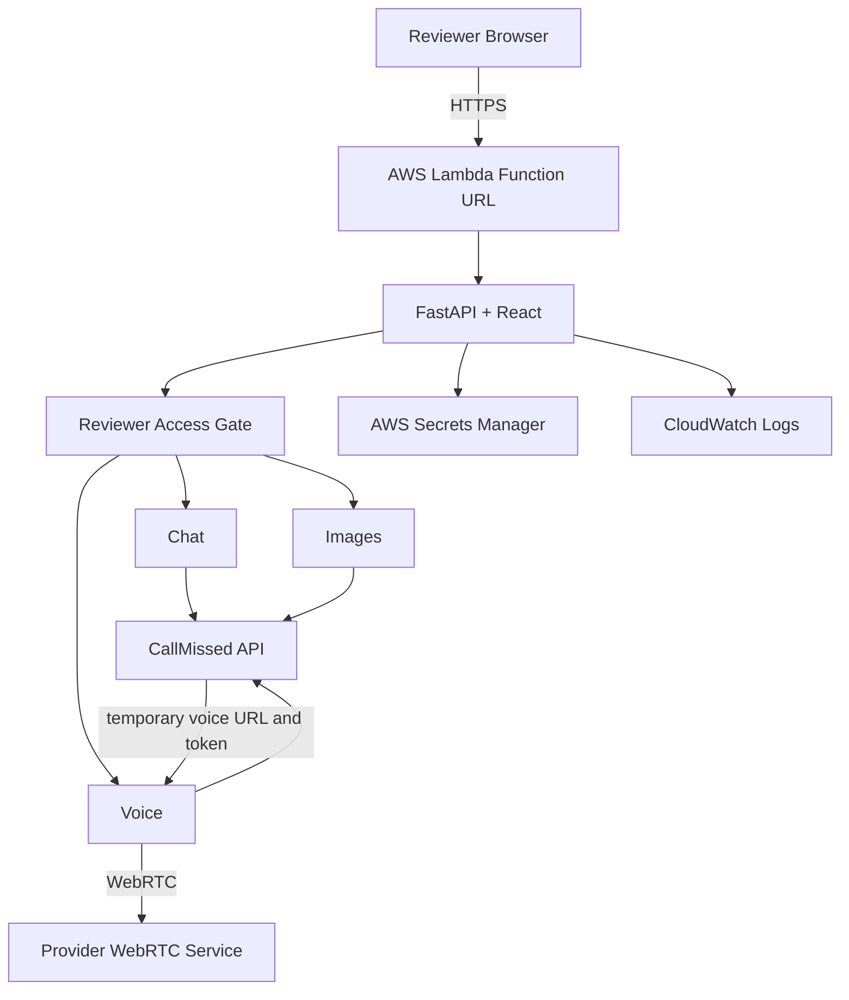

# Architecture

## 1. Purpose

CallMissed AI Workspace is an independent take-home assessment application. It exposes three CallMissed capabilities:

- text chat;
- image generation;
- browser voice interaction.

The design intentionally keeps the application small. It does not include permanent application storage, user accounts, billing, CRM, RAG, phone calling, or multi-tenant administration.

---

## 2. System overview



---

## 3. User-facing routes

| Route | Purpose |
|-------|---------|
| `/chat` | Multi-turn AI chat |
| `/images` | Image generation and local download |
| `/voice` | Browser voice conversation |

Unknown application routes resolve to `/chat`.

---

## 4. Chat flow

1. The reviewer enters a message.
2. React keeps the current conversation only in browser memory.
3. React sends a bounded list of user and assistant messages to FastAPI.
4. FastAPI validates the request.
5. FastAPI adds the trusted system prompt.
6. FastAPI calls the configured CallMissed chat model.
7. FastAPI accepts only normal `message.content` as the answer. Provider reasoning fields are not exposed.
8. React displays the answer.

Limits:

- maximum 12 messages per request;
- maximum 2,000 characters per message;
- maximum 12,000 characters total;
- final request message must be from the user;
- maximum output token setting: 1,024;
- provider timeout: 60 seconds.

No automatic retry occurs after an ambiguous provider timeout.

---

## 5. Image flow

1. The reviewer submits a prompt.
2. React validates the prompt and optional local style text.
3. FastAPI validates the final prompt.
4. FastAPI requests one 1024 × 1024 image from CallMissed.
5. The provider returns base64 image content.
6. FastAPI validates the decoded image type and size.
7. React converts the result to a browser Blob.
8. The reviewer can download the generated image locally.

Limits:

- maximum prompt size: 1,000 characters (including any appended style text);
- one image per request;
- decoded image limit: 4 MiB;
- PNG or JPEG only;
- provider timeout: 90 seconds.

No permanent image store is used.

---

## 6. Voice flow

1. The reviewer selects **Start conversation**.
2. The browser requests microphone permission.
3. FastAPI asks CallMissed to create a bounded voice session.
4. CallMissed returns:
   - provider session ID;
   - temporary WebRTC URL;
   - temporary connection token.
5. FastAPI creates an application-signed lease tied to that session ID.
6. The browser connects directly to the provider media service using `livekit-client`. Audio does not pass through FastAPI.
7. Mute and unmute control the browser microphone publication.
8. **End** releases local microphone tracks first.
9. The browser asks FastAPI to terminate the provider session.
10. FastAPI accepts the termination request only if the signed lease matches the provider session ID.

The application does not use a separate LiveKit account or API credential. CallMissed's Voice Session API returns the temporary WebRTC URL and token consumed by `livekit-client`.

Voice configuration:

- `voice`: `meera`;
- `language`: `en-IN`;
- maximum duration: 180 seconds;
- create timeout: 30 seconds;
- termination timeout: 15 seconds.

The provider duration cap is the final cleanup backstop if the browser closes unexpectedly.

---

## 7. Application API

### Health

```
GET /health/live
GET /health/ready
```

`/health/live` confirms that the application process can answer HTTP.  
`/health/ready` confirms that required runtime configuration is present.

Normal health checks do not make paid CallMissed requests.

### Chat

```
POST /api/chat
```

### Images

```
POST /api/images
```

### Voice

```
POST  /api/voice/sessions
DELETE /api/voice/sessions/{id}
```

### Reviewer access

```
GET  /api/access/status
POST /api/access/login
POST /api/access/logout
```

---

## 8. Error contract

User-visible application failures use:

```json
{
  "error": {
    "code": "provider_timeout",
    "message": "The request timed out. It may have completed upstream; retry only if you choose to.",
    "request_id": "abc123...",
    "retryable": true
  }
}
```

Expected status categories:

| HTTP | Meaning |
|------|---------|
| 401/403 | Reviewer access or ownership failure |
| 413 | Application size limit |
| 422 | Invalid request |
| 429 | Application or provider throttling |
| 502 | Provider authentication, permission, service, or format failure |
| 503 | Application configuration or paid-request kill switch |
| 504 | Provider timeout |

The browser is not given raw provider responses, stack traces, authorization headers, or runtime secrets.

---

## 9. Production hosting

Region: `us-east-1`

Hosting: AWS Lambda container image + AWS Lambda Web Adapter + AWS Lambda Function URL

Lambda settings:

| Setting | Value |
|---------|-------|
| Package | Container image |
| Architecture | x86_64 |
| Memory | 1,024 MB |
| Timeout | 120 seconds |
| Reserved concurrency | Unreserved (`-1`); account quota did not permit a reserved allocation |
| Function URL auth | NONE (protected by reviewer gate) |
| Invoke mode | BUFFERED |
| VPC | None |

Logging: CloudWatch log group `/aws/lambda/callmissed-ai-workspace` with 14-day retention. Logs record only operational metadata — request ID, method, route, HTTP status, elapsed time, safe error code. No prompts, responses, keys, or tokens.

---

## 10. Container

The `Dockerfile` uses a multi-stage build.

Build stage:

- Node.js → `npm ci` → Vite production build.

Runtime stage:

- Python slim image → FastAPI → built React assets → AWS Lambda Web Adapter → non-root application user.

The same application container can run:

- locally with Docker;
- through Docker Compose;
- on AWS Lambda.

---

## 11. Secrets

| Environment | Storage |
|-------------|---------|
| Local development | `backend/.env` (gitignored) |
| Production | AWS Secrets Manager `callmissed-ai-workspace/runtime` |

Production secret fields:

```
CALLMISSED_API_KEY
APP_SESSION_SECRET
REVIEWER_PASSCODE_HASH
```

The Lambda execution role is permitted to read the required runtime secret. The application caches the loaded secret for the process lifetime.

Secret values are not stored in Git, GitHub Actions variables, Docker build arguments, frontend code, Terraform configuration, or Terraform state.

---

## 12. Reviewer authentication

The deployed paid endpoints use a small reviewer gate.

- The stored reviewer passcode is a PBKDF2-SHA256 hash.
- Successful login creates a signed cookie with `HttpOnly`, `Secure` in production, `SameSite=Strict`, and a limited lifetime.

This mechanism protects the assessment API budget. It is not an application account system.

---

## 13. Provider budget controls

CallMissed provided a USD 20 API budget for the take-home. Controls include:

- reviewer gate;
- fixed tested provider models;
- bounded chat requests;
- one image per request;
- 180-second voice limit;
- application request throttling (soft rate limit: 12 paid requests per minute);
- no automatic retry after ambiguous provider POST timeouts;
- server-side `PAID_REQUESTS_ENABLED` kill switch;
- mocked provider responses in routine CI.

Routine CI consumes no CallMissed API budget. If the supplied budget is exhausted or appears incorrect, the assignment contact requested that issues be reported to karan@callmissed.com.

---

## 14. Continuous integration

Pull-request and `main`-branch checks include:

- Ruff;
- pytest (19 tests, all mocked);
- TypeScript and Vite build;
- Trivy repository scan (vulnerabilities, secrets, misconfigurations);
- Docker image build;
- container health checks and frontend route smoke check;
- Trivy container scan;
- Terraform formatting and validation.

Real provider credentials are not supplied to normal CI.

---

## 15. Continuous delivery

A successful `main`-branch CI run triggers the deployment workflow:

```text
tested commit
      ↓
GitHub OIDC
      ↓
temporary AWS role credentials
      ↓
Docker build
      ↓
immutable ECR image
      ↓
resolve digest
      ↓
capture current Lambda image
      ↓
deploy new image
      ↓
wait for Lambda update
      ↓
health checks
```

If deployment health checks fail:

```text
health failure
      ↓
previous resolved ECR image
      ↓
Lambda update
      ↓
rollback complete
```

GitHub does not store long-lived AWS access keys. GitHub OIDC is used to obtain temporary AWS credentials.

---

## 16. Logging

Lambda sends runtime logs to CloudWatch Logs. The application logs operational request metadata: request ID, method, route, HTTP status, elapsed time.

Routine application logs do not intentionally include the CallMissed API key, reviewer passcode, prompts, generated answers, generated-image base64, voice tokens, or signed leases.

---

## 17. Terraform-managed resources

Terraform manages:

- ECR repository and lifecycle policy;
- Secrets Manager secret metadata;
- CloudWatch log group;
- Lambda execution IAM role and policy;
- Lambda function;
- Lambda Function URL;
- GitHub OIDC provider;
- GitHub deployment IAM role.

Terraform state is stored remotely in a private versioned S3 bucket (`callmissed-ai-workspace-tfstate-888284248249`). The state bucket was bootstrapped separately and is removed separately during final teardown.

---

## 18. Availability and limitations

This is a single-region assessment deployment. It does not claim high availability, zero downtime, multi-region failover, or distributed rate limiting.

The deployment process emphasises reproducibility, health verification, and recovery rather than high-availability infrastructure.

Lambda cold starts (3–8 seconds) occur after periods of inactivity. This is a known Lambda container-image characteristic.
